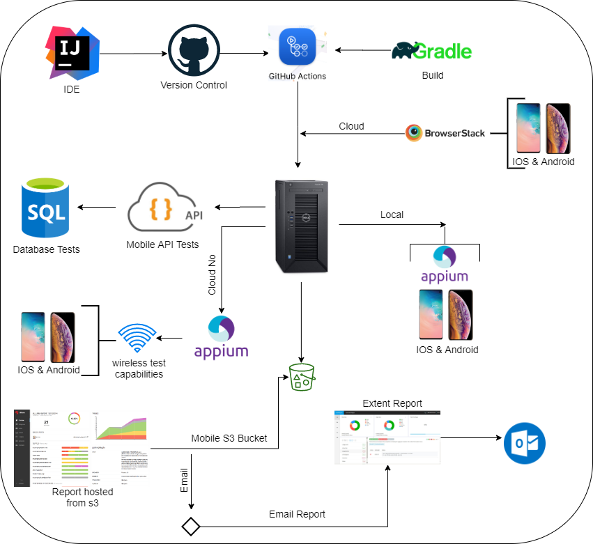
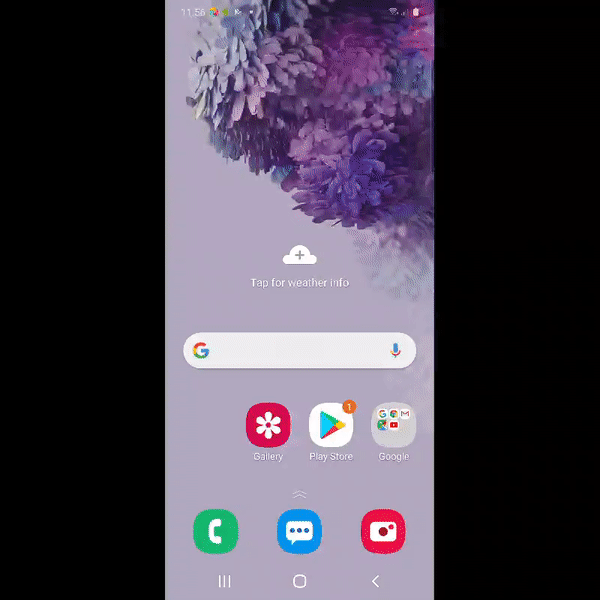

## Mobile Test Framework

### Architecture

### Supported Platforms

Appium supports app automation across a variety of platforms, like iOS,Android, from any platform. Each
platform is supported by one or more "drivers", which know how to automate that particular platform. Choose a driver
below for specific information about how that driver works and how to set it up:

* Android
    * The [UiAutomator2 Driver](https://appium.io/docs/en/drivers/android-uiautomator2/)
* IOS
    * The [XCUITest](https://appium.io/docs/en/drivers/ios-xcuitest/)

### Why [Appium](https://appium.io/docs/en/about-appium/intro/)?

* Appium is an Open source automation tool used for cross platform testing like native, hybrid and web applications on
  both the platforms IOS and Android. Its capability for testing all kinds of tools under one platform, makes it a
  multipurpose and convenient testing tool.Appium is called as a cross platform testing tool because it uses JSON wire
  protocol internally to interact with native apps of IOS and Android using Selenium Webdriver.

### Setup & Tools

* Download and install [Nodejs](https://nodejs.org/en/download/)   
  ``
  npm install -g appium
  ``  
  ``
  npm install -g appium-doctor
  ``
  verify all appium dependencies
* [Download Appium Desktop](https://github.com/appium/appium-desktop/releases) download the latest release
* [Install InteliJ Community Edition](https://www.jetbrains.com/idea/download/)
* [Java JDK_11](https://adoptopenjdk.net/) install jdk_11 version
* [Gradle](https://gradle.org/next-steps/?version=6.7.1&format=bin)
* [Allure](https://github.com/allure-framework/allure2/archive/2.14.0.zip)
* Set the below environment variables

```shell
  * JAVA_HOME: Pointing to the Java SDK folder\bin
  * GRADLE_HOME: Pointing to Gradle directory\bin.
  * ALLURE_HOME: Pointing to allure directory\bin.
  * APPIUM_HOME: Pointing appium main.js from global location.
  * NODE_HOME: Pointing nodejs installation.
```

* For more details navigate to the above [Wiki Page](https://github.com/dipjyotimetia/MobileTestFramework/wiki)

### Connect - Local Devices:

Connect an Android and an iOS Device using a USB cable to your PC

- Follow documentation for device connection

### Getting Started

```shell
$ git clone 
$ cd 
$ import project from intelij as a gradle project
$ gradle clean
$ gradle build
$ gradle task E2E
$ gradle allureReport
$ gradle allureServe
```

### Write your first user journey

Create new class and name as the TC00*_E2E_TEST-***

- Provide jira link in @Link
- Provide all the api components as @Feature
- Provide test severity and description
- Write test
- Use CatchBlock in try/catch section

#### Android Execution


#### iOS Execution


